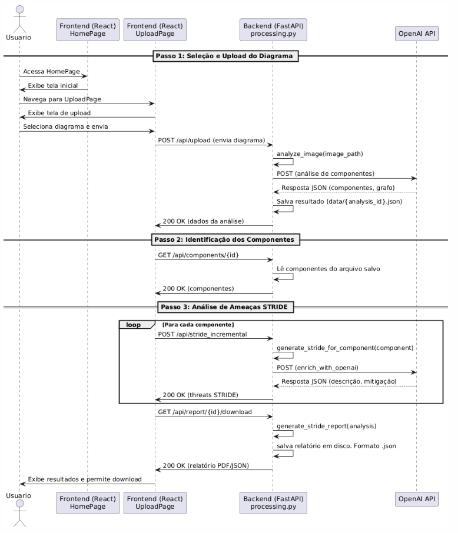

# FIAP STRIDE Threat Modeler

Aplicação web de análise de vulnerabilidades de sistemas baseada na metodologia **STRIDE**, que permite enviar diagramas de arquitetura de software, realizar análise automática com **IA** e gerar relatórios completos.

---

## Tecnologias utilizadas

### Backend

* **Python 3.11+**
* **FastAPI** (API REST)
* **Uvicorn** (servidor ASGI)
* **OpenAI API** (análise de diagramas e geração de STRIDE threats)

### Frontend

* **React 18**
* **React Router DOM** (navegação)
* **Tailwind CSS** (estilização responsiva)
* **Framer Motion** (animações)
* **Axios** (requisições HTTP)

---

## Deploy e configuração

### Backend (Render)
- O backend está publicado em Render e já configurado para uso temporário de arquivos.
- Não é necessário configuração adicional para uso público.

### Frontend (Vercel)
- O frontend está publicado em Vercel e já aponta para o backend no Render.
- Não é necessário configuração adicional para uso público.

---

## Estrutura do projeto

```
.
├── README.md
├── backend/
│   ├── processing.py
│   ├── requirements.txt
│   ├── server.py
└── frontend/
    ├── index.html
    ├── package.json
    ├── postcss.config.js
    ├── tailwind.config.js
    └── src/
        ├── App.jsx
        ├── index.css
        ├── main.jsx
        ├── assets/
        │   └── logo.png
        ├── components/
        │   └── ui/
        │       ├── Button.jsx
        │       └── Card.jsx
        └── pages/
            ├── HomePage.jsx
            └── UploadPage.jsx
```

---

## Visão geral rápida

A aplicação tem o frontend hospedado em [https://fiapswsecurity.vercel.app/](https://fiapswsecurity.vercel.app/) e o backend em [https://hackaton-7orn.onrender.com/](https://hackaton-7orn.onrender.com/).  
Se preferir, é possível executar tudo localmente — veja o [Veja como executar localmente](#executar-localmente) para os passos de instalação e execução local.

---

## Passo a passo (recomendado para uso imediato)

1. **“Acordar” o backend (Render):**  
   Abra [https://hackaton-7orn.onrender.com/docs](https://hackaton-7orn.onrender.com/docs) no seu navegador e aguarde o carregamento do Swagger UI.  
   Isso “acorda” o servidor hospedado (se estiver em modo de hibernação).

2. **Executar a aplicação no frontend:**  
   Depois que o Swagger carregar com sucesso, acesse [https://fiapswsecurity.vercel.app/](https://fiapswsecurity.vercel.app/) e navegue pela interface para executar a transação desejada.

3. **Confirmação visual:**  
   Ao abrir o frontend, siga os fluxos na tela para submeter a transação; o frontend fará chamadas ao backend já acordado.

---

## Execução local (opcional)

Se preferir rodar tudo localmente, siga as instruções completas em [Veja como executar localmente](#executar-localmente) (instalação de dependências, variáveis de ambiente e comandos de start).

---

## Observações úteis

- Se o backend demorar alguns segundos para responder após abrir `/docs`, aguarde; isso é normal quando o serviço estava ocioso.
- Caso encontre erros de CORS ou de conexão, verifique se você está usando as URLs corretas e consulte o README para configuração local (variáveis de ambiente).
- Para testes repetidos, primeiro verifique `/docs` para garantir que o backend está ativo antes de usar o frontend.

---

## Executar localmente
## Backend - Instalação e execução

1. **Criar ambiente virtual**:

```bash
cd backend
python -m venv venv
source venv/bin/activate   # Linux/Mac
venv\Scripts\activate      # Windows
```

2. **Instalar dependências**:

```bash
pip install -r requirements.txt
```

3. **Configurar chave da OpenAI**:

```bash
export OPENAI_API_KEY="sua_chave_aqui"  # Linux/Mac
set OPENAI_API_KEY="sua_chave_aqui"     # Windows
```

4. **Rodar o servidor**:

```bash
uvicorn server:app --reload --host 0.0.0.0 --port 8000
```

O backend estará disponível em `http://localhost:8000`.

---

## Frontend - Instalação e execução

1. **Instalar dependências**:

```bash
cd frontend
npm install
```

2. **Rodar em modo desenvolvimento**:

```bash
npm run dev
```

3. **Abrir navegador**:

```
http://localhost:5173/
```

---

## Rotas principais da aplicação

| Rota Frontend | Página / Funcionalidade             |
| ------------- | ----------------------------------- |
| `/`           | HomePage - Boas-vindas + navegação  |
| `/upload`     | UploadPage - Envio de diagramas     |

---

## Funcionalidades

1. **HomePage**: Tela inicial com apresentação e navegação.
2. **UploadPage**: Envia diagramas de arquitetura para análise automática usando IA, identifica componentes, executa análise STRIDE e permite download de relatórios.

---

## Integração com OpenAI

* O backend utiliza a API da OpenAI para processar a imagem do diagrama e gerar um **modelo de ameaças STRIDE**.
* Para funcionar, é necessário ter uma chave válida da OpenAI configurada como variável de ambiente (`OPENAI_API_KEY`). Foi disponibilizada uma chave válida no arquivo PDF com a apresentação do trabalho.

---

## Observações importantes

* O frontend espera que o backend esteja rodando em `http://localhost:8000`. Ajuste se estiver em outro endereço ou porta.
* A aplicação é responsiva e utiliza componentes estilizados (`Card`, `Button`) com animações suaves (`framer-motion`).
* Relatórios são gerados em JSON e PDF, podendo ser baixados diretamente do frontend.

---

## Execução completa

1. Rodar backend:

```bash
cd backend
uvicorn server:app --reload --host 0.0.0.0 --port 8000
```

2. Rodar frontend:

```bash
cd frontend
npm install
npm run dev
```

3. Abrir `http://localhost:5173/` no navegador.

---

## Diagrama de sequência do projeto


